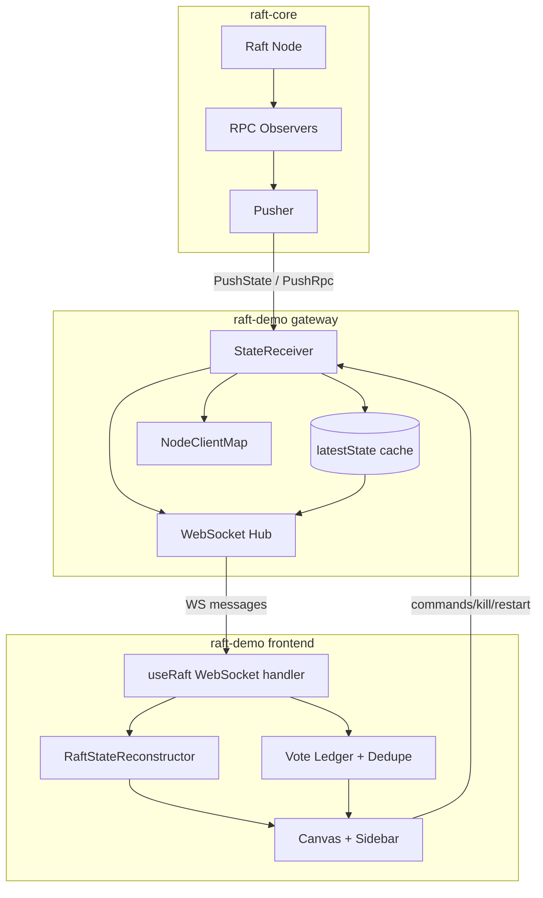
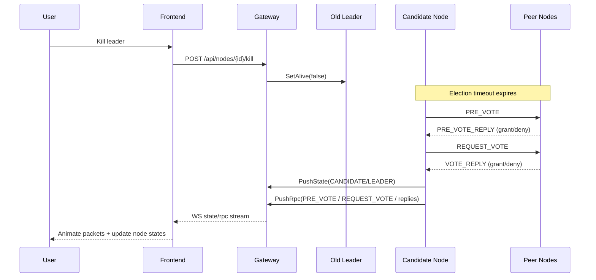
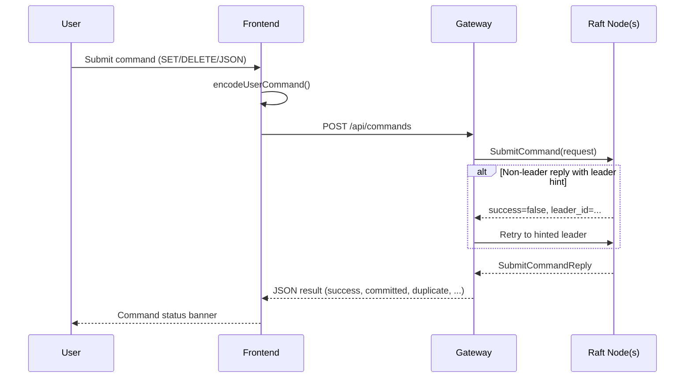
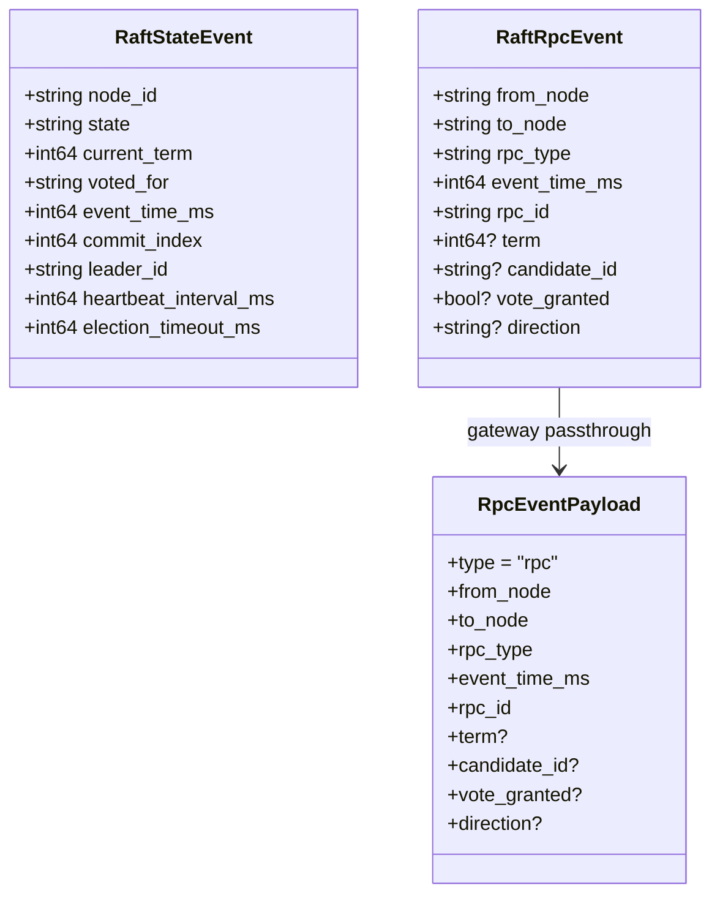
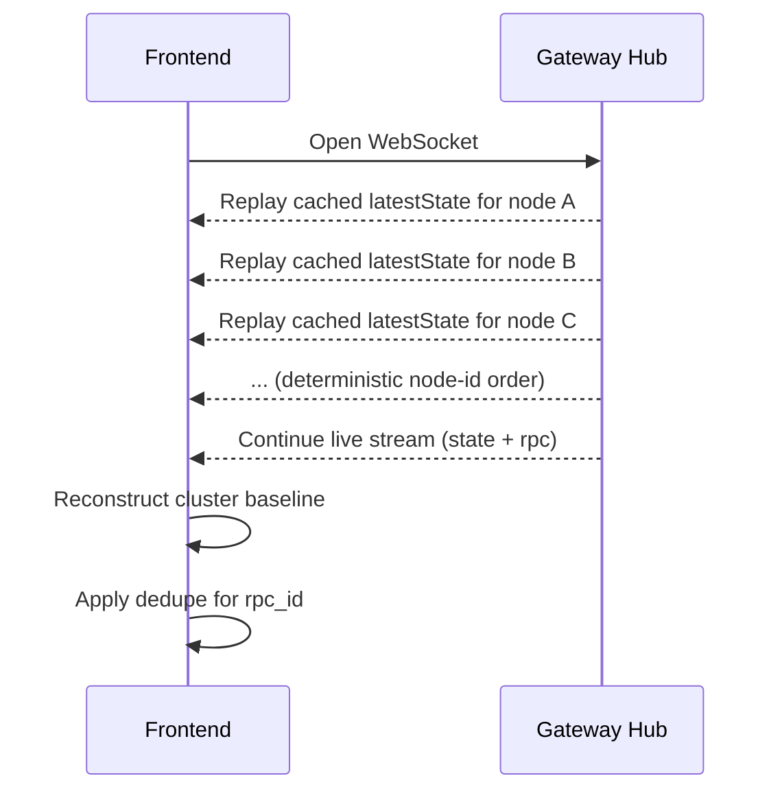
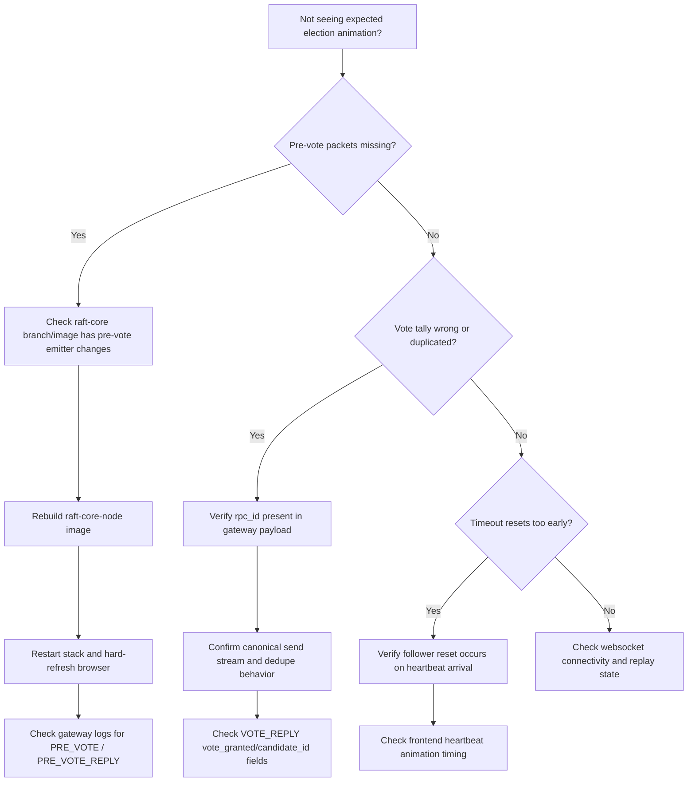

# Architecture Diagrams (Drafts)

These are first-pass Mermaid drafts for user-facing documentation.
They are intentionally simple and can be refined later for style and depth.

## 1) System Context

```mermaid
flowchart LR
    subgraph Cluster[Raft Cluster]
      A[Node A]
      B[Node B]
      C[Node C]
      D[Node D]
      E[Node E]
    end

    G[Gateway]
    F[Frontend UI]
    U[User]

    A -->|PushState / PushRpc (gRPC)| G
    B -->|PushState / PushRpc (gRPC)| G
    C -->|PushState / PushRpc (gRPC)| G
    D -->|PushState / PushRpc (gRPC)| G
    E -->|PushState / PushRpc (gRPC)| G

    G -->|WebSocket stream| F
    U -->|Browser interaction| F
    F -->|REST control API| G
    G -->|SetAlive / SubmitCommand (gRPC)| Cluster
```

## 2) Container / Component Diagram



## 3) Sequence: Leader Failover



## 4) Sequence: Command Roundtrip



## 5) Data Contract Diagram



## 6) State Reconstruction Flow

```mermaid
flowchart TD
    M[Incoming WS message] --> T{message.type == rpc?}
    T -- No --> S[Apply state event]
    S --> R[RaftStateReconstructor.applyEvent]
    R --> UI1[Render nodes/roles/timers]

    T -- Yes --> D[Direction gate: SEND only]
    D --> K[Dedupe by rpc_id]
    K --> RT{rpc_type}

    RT -- APPEND_ENTRIES --> HB[Add heartbeat packet]
    HB --> ARR{Packet arrived?}
    ARR -- Yes --> HR[applyHeartbeat(to_node)]
    HR --> UI1

    RT -- PRE_VOTE / PRE_VOTE_REPLY --> PM[Animate pre-vote packets]
    PM --> UI2[Render packet trail]

    RT -- REQUEST_VOTE --> RV[Animate request vote packet]
    RV --> SV[Seed candidate self-vote]
    SV --> UI2

    RT -- VOTE_REPLY --> VR[Animate vote reply packet]
    VR --> VL[Update vote ledger]
    VL --> VT[Derive candidate tally]
    VT --> UI3[Render tally/quorum status]
```

## 7) Reconnect Replay



## 8) Troubleshooting Decision Tree



